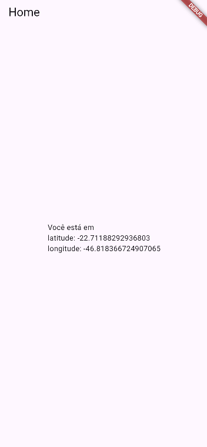

# 📍 Geolocalização GPS com Flutter

Aplicativo desenvolvido em **Flutter** para obter a localização atual do dispositivo utilizando o sensor GPS e a biblioteca **Geolocator**.

## 🎯 Objetivo

O objetivo deste projeto é desenvolver um aplicativo capaz de solicitar a permissão de localização do usuário e apresentar na tela as coordenadas da sua posição atual, mostrando os valores de **latitude** e **longitude**.

## ⚙️ Funcionalidades

* 📍 Verificar se o serviço de localização está ativado;
* 🔐 Solicitar permissão para acessar a localização;
* 🌎 Obter a localização atual do dispositivo;
* 📌 Exibir a latitude;
* 📌 Exibir a longitude;
* ⚠️ Informar quando a permissão de localização for negada.

## 🛠️ Tecnologias utilizadas

* **Flutter**
* **Dart**
* **Geolocator**
* **Android / Chrome**

## 📦 Dependência utilizada

O projeto utiliza o pacote:

```yaml
geolocator: ^13.0.2
```

Para instalar a dependência:

```bash
flutter pub add geolocator
```

## 🔐 Permissões

Para que o aplicativo consiga acessar a localização no Android, foram adicionadas as permissões no arquivo `AndroidManifest.xml`:

```xml
<uses-permission android:name="android.permission.ACCESS_FINE_LOCATION" />
<uses-permission android:name="android.permission.ACCESS_COARSE_LOCATION" />
```

No iOS, é necessário adicionar a permissão de localização no arquivo `Info.plist`.

## 📱 Como funciona

Ao iniciar o aplicativo, a função `obterCoordenadasGPS()` é executada.

Primeiro, o aplicativo verifica se o serviço de localização está ativado. Depois, verifica a permissão para acessar a localização.

Após a permissão ser concedida, o aplicativo utiliza o **Geolocator** para obter a posição atual e apresenta na tela os valores de latitude e longitude.

## 🖼️ Prints do projeto

### Tela do aplicativo

<p align="center">
  
</p>

## ▶️ Como executar o projeto

1. Clone o repositório:

```bash
git clone https://github.com/MIRELLA-02/appgps.git
```

2. Entre na pasta do projeto:

```bash
cd flutter_application_gps
```

3. Instale as dependências:

```bash
flutter pub get
```

4. Execute o aplicativo:

```bash
flutter run
```

Para executar no Chrome:

```bash
flutter run -d chrome
```

> 💡 Ao executar no navegador, é necessário permitir que o Chrome acesse a localização do dispositivo.

## 👩‍💻 Desenvolvedora

**Mirella Brolezi**

Projeto desenvolvido como atividade prática de **Desenvolvimento de Sistemas - SENAI**. ✨
